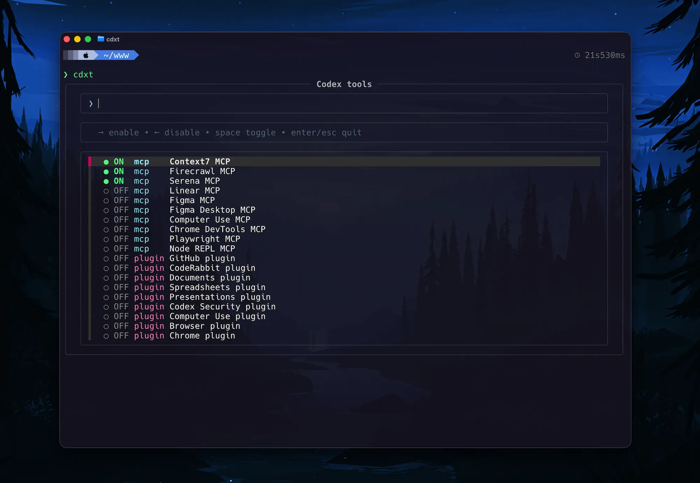

# cdxt — Codex tools toggle

An interactive on/off switch for MCP servers and plugins in the [Codex CLI](https://github.com/openai/codex) config file (`~/.codex/config.toml`).

Instead of editing TOML by hand every time you want to enable or disable an MCP server or a plugin, run `cdxt`, pick the item, and it flips the `enabled` flag for you — with an automatic backup of the config before every change.



## Demo

▶ [Watch a 30-second demo](assets/cdxt-demo.mp4) — GitHub opens the video with an inline player.

## Features

- Lists the `[mcp_servers.*]` and `[plugins."*"]` sections found in your Codex config
- Toggles the `enabled` flag in place, preserving the rest of the file untouched
- Automatic timestamped backup of `config.toml` before every write (keeps the last 20 by default)
- Two interfaces: a fuzzy-searchable fzf UI, and a plain-text numbered menu as a fallback
- Non-interactive subcommands (`list`, `toggle`, `set`) for scripting

## Requirements

| Dependency | Required? | Notes |
|------------|-----------|-------|
| `zsh` | Yes | Pre-installed on macOS. On Linux: `sudo apt install zsh` (or `dnf`/`pacman`). Your login shell does **not** need to be zsh — the script runs under zsh via its shebang. |
| `awk` | Yes | Any POSIX awk works (BSD awk, gawk, mawk). Already present on macOS and every mainstream Linux distro. |
| `fzf` ≥ 0.71 | No | Enables the visual menu. Older fzf versions are detected and the script falls back to the text menu automatically. See [installing a recent fzf](#installing-a-recent-fzf). |
| `trash` | No | Used to prune old backups and to clean up orphan temp files from failed writes. Without it, both simply accumulate (nothing breaks). macOS: `brew install trash`. |

## Installation

### 1. Get the script

```bash
git clone https://github.com/everton-dgn/cdxt.git
mkdir -p ~/.codex/scripts
cp cdxt/cdxt ~/.codex/scripts/cdxt
chmod +x ~/.codex/scripts/cdxt
```

Prefer updating with `git pull` instead of re-copying? Skip the `cp`/`chmod` lines and use Option C below.

### 2. Make it callable as `cdxt`

Pick **one** of the options below.

**Option A — shell alias (recommended).** Add the alias to the rc file of the shell you actually use:

```bash
# If your shell is zsh (default on macOS):
echo 'alias cdxt="$HOME/.codex/scripts/cdxt"' >> ~/.zshrc
source ~/.zshrc

# If your shell is bash (default on most Linux distros):
echo 'alias cdxt="$HOME/.codex/scripts/cdxt"' >> ~/.bashrc
source ~/.bashrc
```

Not sure which shell you use? Run `echo $SHELL`.

**Option B — symlink on your PATH.** Works from any shell without an alias:

```bash
mkdir -p ~/.local/bin
ln -s ~/.codex/scripts/cdxt ~/.local/bin/cdxt
```

Make sure `~/.local/bin` is on your PATH (`echo $PATH | tr ':' '\n' | grep .local`). If it is not, add `export PATH="$HOME/.local/bin:$PATH"` to your rc file.

**Option C — run straight from the clone.** No copy involved: point the alias at the script inside the cloned repo, and `git pull` updates the command in place:

```bash
echo 'alias cdxt="$HOME/cdxt/cdxt"' >> ~/.zshrc   # adjust the path to where you cloned it
source ~/.zshrc
```

### 3. Verify

```bash
cdxt help
```

If you get `command not found`, open a new terminal (rc files are only read by new shells) and check [Troubleshooting](TROUBLESHOOTING.md#command-not-found-cdxt).

### Installing a recent fzf

The visual menu needs fzf **0.71 or newer** (it relies on `--id-nth`, added in 0.71.0). Distro packages are often much older — the fzf shipped by Ubuntu's `apt`, for example, does not qualify.

```bash
# macOS
brew install fzf

# Linux — download the latest release binary:
# https://github.com/junegunn/fzf/releases
```

Check your version with `fzf --version`. With an old (or missing) fzf, `cdxt` still works — it uses the numbered text menu instead.

## Usage

```bash
cdxt              # interactive menu
cdxt list         # print the numbered list with ON/OFF status
cdxt toggle 6     # toggle item 6
cdxt set 6 true   # force item 6 to a specific state (true or false)
cdxt help         # usage and environment variables
cdxt version      # print cdxt version
```

Keys in the fzf menu:

| Key | Action |
|-----|--------|
| `→` | enable the highlighted item |
| `←` | disable the highlighted item |
| `Space` | toggle the highlighted item |
| `Enter` / `Esc` | quit |

> **Heads-up:** after toggling anything, restart Codex or open a new Codex session. The config file changes immediately, but a running Codex session does not reload its tool list dynamically.

## Configuration

All settings are environment variables — there is no config file for the tool itself.

| Variable | Default | Purpose |
|----------|---------|---------|
| `CODEX_CONFIG` | `~/.codex/config.toml` | Path to the Codex config file to edit |
| `CODEX_HOME` | `~/.codex` | Codex directory. `CODEX_CONFIG` and `CODEX_CONFIG_BACKUP_DIR` default to `$CODEX_HOME/...` |
| `CODEX_CONFIG_BACKUP_DIR` | `~/.codex/config.toml.backups` | Where backups are stored |
| `CODEX_CONFIG_BACKUP_KEEP` | `20` | How many backups to keep (pruning requires the `trash` command) |

## How it works

1. The script scans `config.toml` for `[mcp_servers.<name>]` and `[plugins."<name>"]` sections. Headers must be on a line of their own with no inline comment — exactly the format Codex itself writes. Item names are displayed exactly as they appear in the config — the raw section key, with no reformatting.
2. For each section it reads the `enabled` key. A section without an `enabled` key counts as enabled (Codex's default).
3. When you toggle an item, the script first copies the config to the backup directory, then rewrites the file with `awk`, changing only the `enabled` line of that one section (or inserting it if missing). An inline comment on that line is preserved.

To restore a previous config:

```bash
ls -t ~/.codex/config.toml.backups/   # newest first
cp ~/.codex/config.toml.backups/config.toml.<timestamp> ~/.codex/config.toml
```

## Platform support

| Platform | Status |
|----------|--------|
| macOS | Supported |
| Linux | Supported (install `zsh`; see fzf note above) |
| Windows | **WSL only** — see below |

### Windows: WSL only

The script is written in zsh, so it cannot run natively on Windows (PowerShell, cmd, or Git Bash — none of them provide zsh).

**Setup inside WSL:**

```bash
sudo apt install zsh        # zsh is required; it does not need to be your shell
# optional: install fzf >= 0.71 from the GitHub releases page
```

Then follow the normal [Installation](#installation) steps inside WSL.

**Which config does it edit?** That depends on where Codex runs:

- **Codex running inside WSL** — nothing extra to do. `cdxt` edits the WSL-side `~/.codex/config.toml`.
- **Codex running on native Windows** — its config lives at `C:\Users\<you>\.codex\config.toml`. Point `cdxt` at it through the `/mnt/c` mount:

  ```bash
  CODEX_CONFIG="/mnt/c/Users/<you>/.codex/config.toml" cdxt
  ```

  Make it permanent by exporting the variable in your WSL rc file:

  ```bash
  echo 'export CODEX_CONFIG="/mnt/c/Users/<you>/.codex/config.toml"' >> ~/.bashrc
  ```

  ⚠️ If the Windows-side file uses CRLF line endings, the parser will not match its sections. See [Troubleshooting](TROUBLESHOOTING.md#windows--wsl-issues) for how to detect and fix that.

## Troubleshooting

See [TROUBLESHOOTING.md](TROUBLESHOOTING.md) for common problems and fixes: `command not found`, text menu showing instead of the fzf UI, config not found, WSL/CRLF issues, restoring backups, and more.

## License

[MIT](LICENSE)
